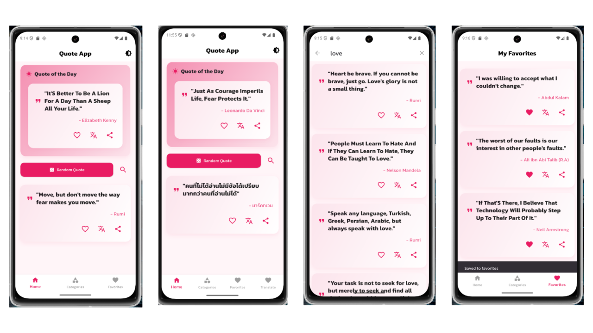
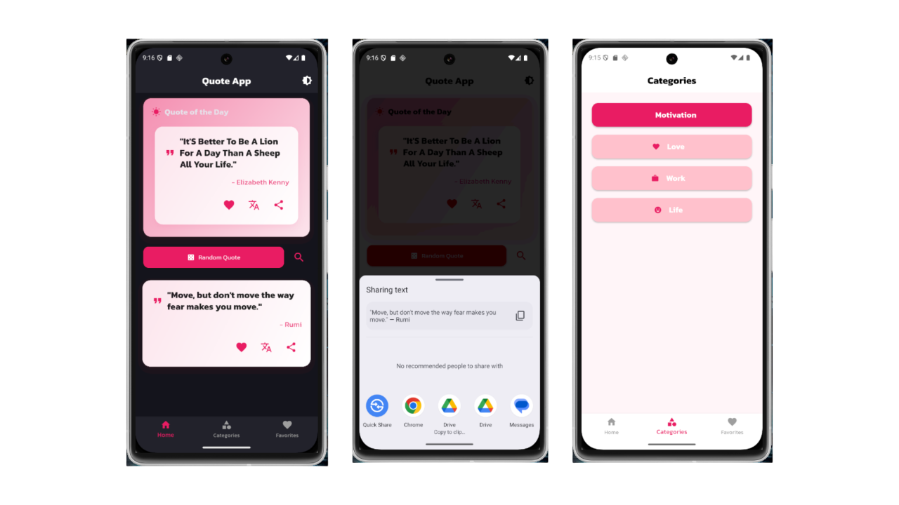

# daily_quote_app

**Daily Quote App** คือแอปพลิเคชัน Flutter สำหรับสุ่มคำคมให้แรงบันดาลใจในแต่ละวัน  
ผู้ใช้สามารถบันทึกคำคมที่ชอบ แชร์ไปยังโซเชียลมีเดีย และแปลคำคมเป็นหลายภาษาได้ทันที  

## ฟีเจอร์หลัก

- **สุ่มคำคม** — เปลี่ยนคำคมทุกครั้งที่ผู้ใช้กดปุ่ม Random
- **บันทึกคำคมโปรด** — เก็บคำคมที่ชอบไว้ใน Favorites
- **แปลภาษาได้ทันที** — รองรับหลายภาษา (ใช้ Google Translate API/translator package)
- **แชร์ไปยังแอปอื่น** — แชร์ข้อความไปยังแอปโซเชียลเช่น Facebook, LINE, Instagram
- **UI สวยงามและลื่นไหล** — ออกแบบด้วย Material Design และเพิ่มเอฟเฟกต์ Animation
- **Responsive** — ใช้งานได้ทั้งมือถือและแท็บเล็ต

## เทคโนโลยีและแพ็กเกจที่ใช้

| Technology / Package | Description |
|----------------------|-------------|
| **Flutter**          | Cross-platform UI framework |
| **Dart**             | ภาษาหลักในการพัฒนา |
| **Provider**         | State management |
| **share_plus**       | แชร์ข้อความไปยังแอปอื่น |
| **translator**       | แปลข้อความแบบเรียลไทม์ |
| **AnimatedContainer**| เพิ่มเอฟเฟกต์การเปลี่ยน UI |
| **Material Design**  | แนวทางการออกแบบ UI |

## โครงสร้างโปรเจกต์
```dart
lib/
├── main.dart # จุดเริ่มต้นของแอป
├── models/
│ └── quote.dart # โครงสร้างข้อมูล Quote
├── providers/
│ └── quote_provider.dart # จัดการ State และข้อมูล
├── pages/
│ ├── home_page.dart # หน้าแสดงคำคม
│ └── favorites_page.dart# หน้ารวมคำคมโปรด
| └── categories_page.dart # หน้าแสดงหมวดหมู่คำคม
├── widgets/
│ └── quote_card.dart # UI ของการ์ดคำคม
└── services/
  └── api_service.dart # ฟังก์ชันเรียก API 
  └── favorites_services.dart # ฟังก์ชันจัดการคมที่ถูกใจ
```

## ตัวอย่างหน้าจอผู้ใช้งาน (User Interface)



## พัฒนาโดย

สมาชิก 

นายสิทธิชัย แสงนนท์ 6612732134

นายพีรพัฒน์ สุทธปัญญา 6612732121

นางสาววาสน มาฤทธ 6712732126

นางสาววรัญญา ฉิมงาม 6712732125

สาขาวิทยาการคอมพิวเตอร์

มหาวิทายาลัยราชภัฏศรีสะเกษ

"Daily Quote App — คำคมดี ๆ เปลี่ยนวันธรรมดาให้มีความหมาย"